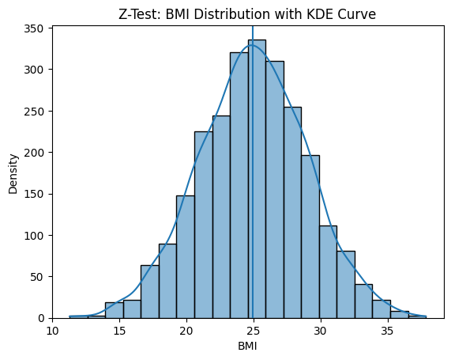
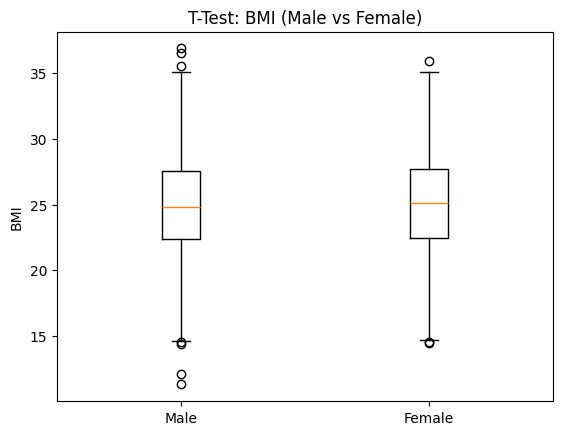
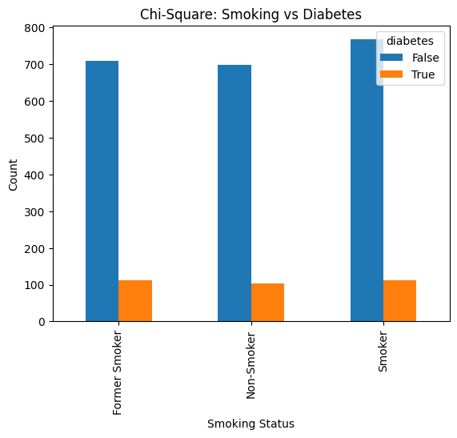
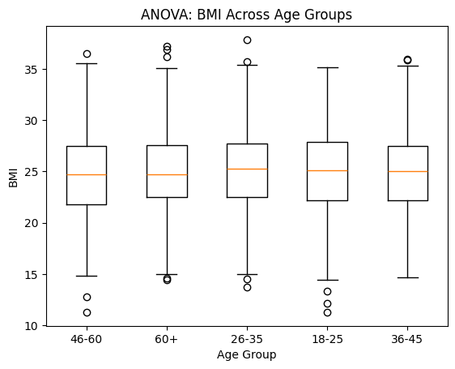
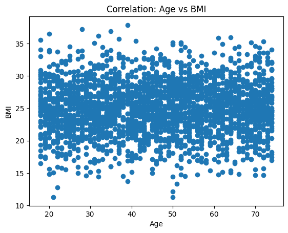

# 📊 Statistical Analysis Project  
## Z-Test | T-Test | Chi-Square | ANOVA | Correlation

---

## 🧑‍🎓 Project Overview

This project demonstrates core inferential statistics concepts using Python and a real-style dataset.

The goal is to analyze health-related data and apply:

- Z-Test  
- T-Test  
- Chi-Square Test  
- ANOVA  
- Correlation  

along with visualization and hypothesis testing.

---

## 📁 Dataset

**File used:** `statistics_project_dataset.csv`

Main columns:

- age  
- bmi  
- gender  
- smoking_status  
- diabetes  
- age_group  

---

## 🛠 Libraries Used

```python
import numpy as np
import pandas as pd
import matplotlib.pyplot as plt
import seaborn as sns
from scipy.stats import norm, f, chi2_contingency, f_oneway, pearsonr, t, ttest_ind
```

## 🎯 Objective

To apply inferential statistical techniques on health data and understand relationships between variables such as BMI, age, smoking status and diabetes.


## 🧪 Hypotheses

- H₀: Smoking status and diabetes are independent  
- H₁: Smoking status affects diabetes  

- H₀: Mean BMI of Male = Female  
- H₁: Mean BMI differs  

- H₀: All age groups have same BMI  
- H₁: At least one age group differs  

- H₀: No correlation between age and BMI  
- H₁: Correlation exists

## 🟢 Z-Test (BMI)
Z = (x̄ − μ) / (σ / √n)



## 🟢 T-Test (Male vs Female BMI)


## 🟢 Chi-Square Test


## 🟢 ANOVA


## 🟢 Correlation



## 🧭 Methodology

1. Load dataset using Pandas  
2. Perform Z-test, T-test, Chi-square, ANOVA and Correlation  
3. Apply decision rules using p-value and critical value  
4. Visualize results using plots  
5. Interpret statistical outcomes


## 📂 Project Structure

project/
│
├── statistics_project_dataset.csv
├── notebook.ipynb
├── README.md
└── images/
    ├── z_test.png
    ├── t_test.png
    ├── chi_square.png
    ├── anova.png
    └── correlation.png


## 🚀 Future Scope

- Add regression analysis  
- Build ML prediction model  
- Deploy dashboard using Streamlit  
- Use larger real-world datasets


## 📌 Learning Outcome

This project improved understanding of inferential statistics, hypothesis testing, Python data analysis and visualization.


