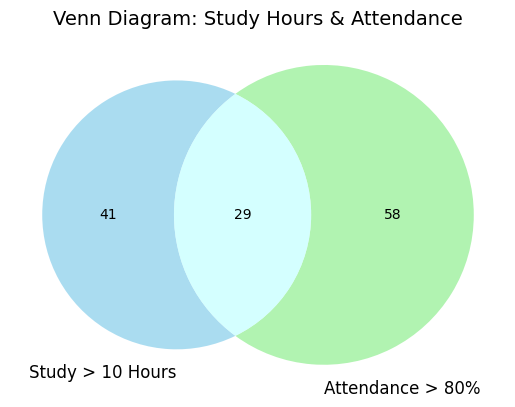

# 📘 Expectation Decider – Probability Project

This is a simple student-friendly probability analysis project using Python and Jupyter Notebook.  
The project studies student performance and applies core probability concepts.

---

## 📂 Project Files

- students_expectation.csv  
- Expectation_Decider.ipynb  
- README.md  
- venn_diagram.png  

(venn_diagram.png is saved from the notebook output)

---

## 🧰 Libraries Used

- pandas  
- numpy  
- matplotlib  
- matplotlib-venn  

Install if needed:

pip install pandas numpy matplotlib matplotlib-venn

---

## 📊 Dataset Description

The dataset contains 200 students with the following columns:

- study_hours – Daily study hours  
- attendance – Attendance percentage  
- group_discussion – Yes / No  
- previous_test_score – Previous marks  
- final_exam_pass – Pass / Fail  

---

## 🎯 Project Objective

To analyze student performance using probability concepts such as:

- Empirical probability  
- Random variable  
- Probability distribution  
- Mean and variance  
- Venn diagram  
- Contingency table  
- Conditional probability  
- Bayes theorem  

---

## 1. Probability

Probability means chance of something happening.

Formula:

Probability = Favourable outcomes / Total outcomes

Examples:
- Student passes exam  
- Student studies more than 10 hours  
- Student joins group discussion  

---

## 2. Empirical Probability

Probability of passing exam is calculated as:

Probability of Pass = Number of Passed Students / Total Students

This gives the real probability based on dataset.

---

## 3. Random Variable

Let X = number of students passing out of 3.

Possible values of X:

0, 1, 2, 3

Let:

p = probability of one student passing  
f = probability of one student failing  

Then:

0 pass = f³  
1 pass = 3pf²  
2 pass = 3p²f  
3 pass = p³  

This gives the probability distribution.

---

## 4. Mean and Variance

Mean (Expected Value):

Shows average number of students passing.

Variance:

Shows how much the result varies from the mean.

These are calculated using:

Mean = Σ(x × P(x))  
Variance = Σ((x − mean)² × P(x))

---

## 5. Venn Diagram

Two conditions are taken:

- Study hours > 10  
- Attendance > 80%  

The Venn diagram shows:

- Left circle → Students studying more than 10 hours  
- Right circle → Students with attendance above 80%  
- Overlapping area → Students satisfying BOTH conditions  

---

## 6. Contingency Table

A contingency table is created using:

- Group Discussion  
- Final Exam Result  

This table helps calculate:

- Joint Probability  
- Marginal Probability  
- Conditional Probability  

---

## 7. Joint, Marginal and Conditional Probability

Joint Probability:

Probability of Group Discussion AND Pass.

Marginal Probability:

Overall probability of Pass.

Conditional Probability:

Probability of Pass GIVEN Group Discussion.

---

## 8. Relationship Between Events

Group discussion and passing exam are DEPENDENT events.

Because:

P(Pass | Group Discussion) ≠ P(Pass)

The probability changes when condition is applied.

---

## 9. Bayes Theorem

Bayes formula:

P(A|B) = (P(B|A) × P(A)) / P(B)

Used to calculate:

P(Pass | High Attendance)

---

## 🧠 Final Conclusion

Students who:

- Study more  
- Attend classes regularly  
- Participate in group discussions  
- Score well in previous tests  

have higher probability of passing exams.

Group discussion and passing exam are dependent events.

---

## 🎓 Learning Outcomes

- Understanding probability  
- Random variables  
- Mean and variance  
- Venn diagram interpretation  
- Contingency table  
- Conditional probability  
- Bayes theorem  
- Python data analysis  

---

## ✨ Author

Student Probability Mini Project  
Using Python & Jupyter Notebook
