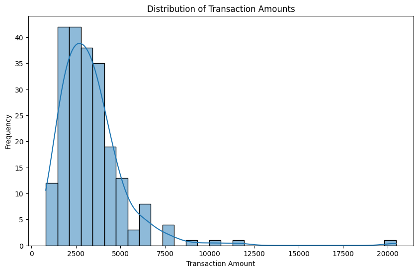
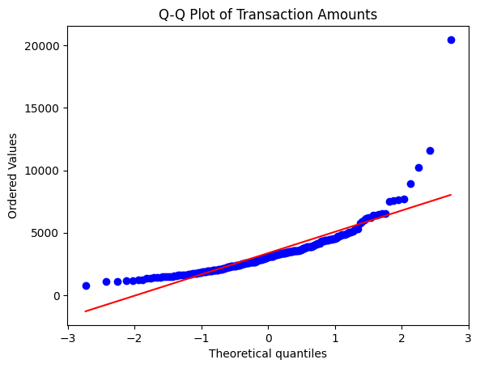
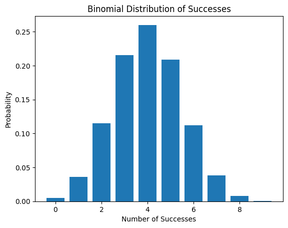
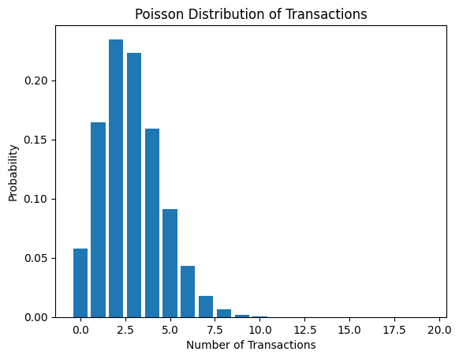
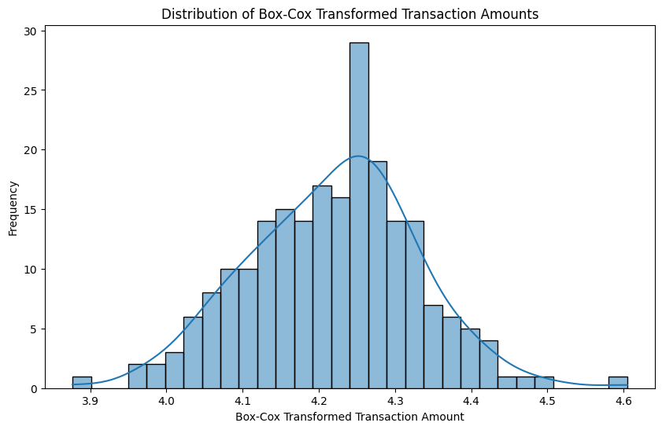
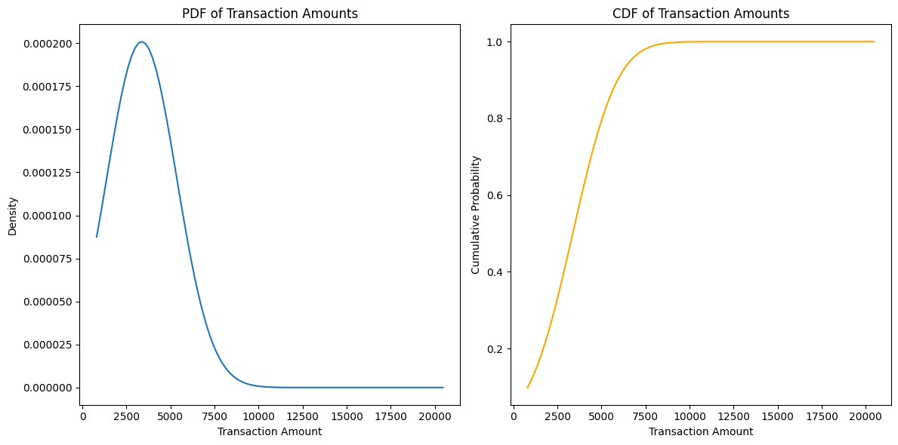

# 📕 Spread Locator – Statistical Distribution Analysis

A Python-based mini data science project that analyzes transaction behavior using statistical distributions and probability techniques.

---

## 🧠 Project Overview

This project studies:

- Transaction success probability  
- Transaction counts per day  
- Transaction amount distribution  
- Skewness handling using Box-Cox  
- Normality check using Q–Q plot  
- Probability estimation using Z-score  
- Visualization using PDF & CDF  

Goal: Understand customer spending patterns and transaction behavior.

---

## 🛠 Technologies Used

- Python  
- Pandas  
- NumPy  
- Matplotlib  
- Seaborn  
- SciPy  

---

## 📂 Dataset

File used: [text](spread_locator_dataset.csv)


Main columns:

- transaction_status  
- transaction_count  
- transaction_amount  

---

## 📈 Statistical Methods Applied

### ✅ Bernoulli Distribution  
Used to model transaction success (Success = 1, Fail = 0).

---

### ✅ Binomial Distribution  
Used for multiple Bernoulli trials (weekly successful transactions).

---

### ✅ Poisson Distribution  
Models number of transactions per day.

---

### ✅ Log-Normal & Power Law  
Used for right-skewed transaction amounts.

---

### ✅ Q–Q Plot  
Checks whether data follows Normal distribution.

---

### ✅ Box-Cox Transformation  
Reduces skewness and stabilizes variance.

---

### ✅ Z-Score Probability  

Formula: z = (x − μ) / σ


Used to calculate probability of transaction amount exceeding ₹5000.

---

### ✅ PDF & CDF  

- PDF → probability density  
- CDF → cumulative probability  

---

## 🖼 Sample Plots

### Transaction Amount Distribution


### Q–Q Plot


### Binomial Distribution


### Poisson Distribution


### Box-Cox Transform


### PDF & CDF


> 📌 Tip: Save plots in Python using:
```python
plt.savefig("plots/binomial.png")


---

If you’d like next, I can also help you with:

✅ Folder structure (`plots/`, `notebooks/`)  
✅ GitHub repo description  
✅ `requirements.txt`  
✅ How to auto-save plots  
✅ Project cover banner  

Just tell me 👍

