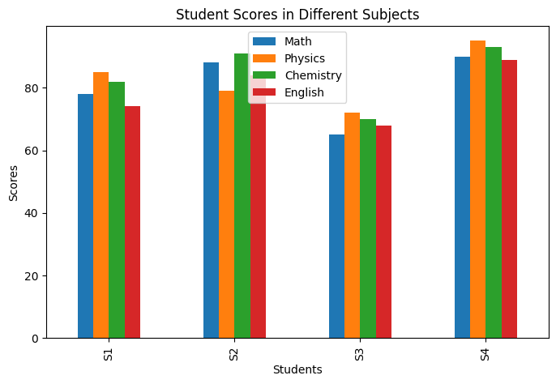
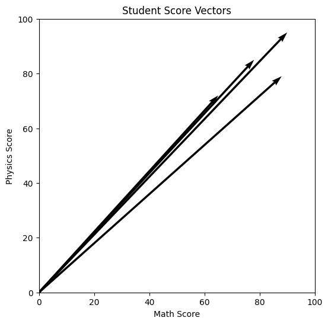
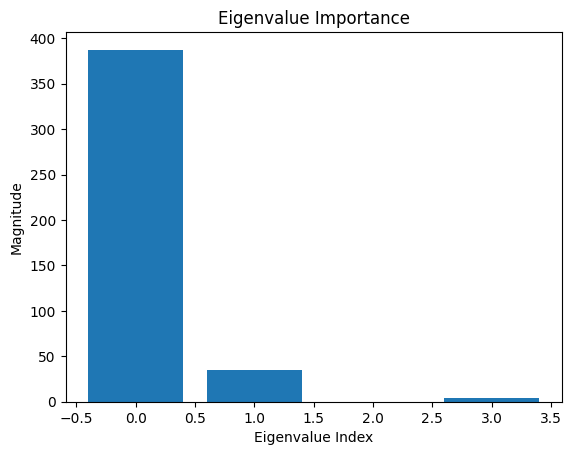
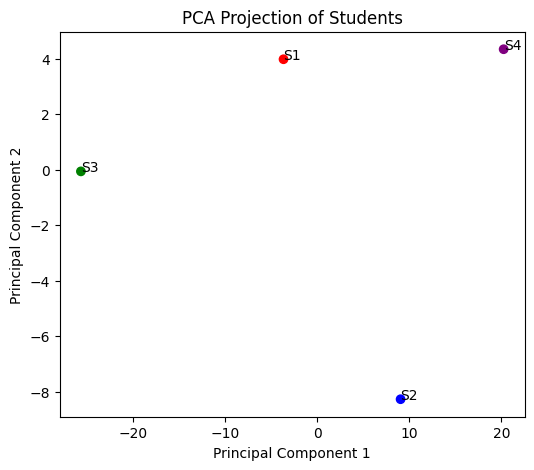
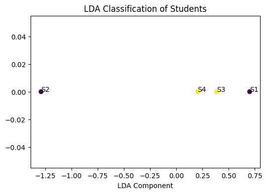

# 📕 Calculative Foundation — Linear Algebra Project

> A hands-on linear algebra project applied to student score data, covering vector operations, matrix decompositions, and dimensionality reduction.

---

## 📌 Dataset

Student scores across 4 subjects used throughout the project:

| Student | Math | Physics | Chemistry | English |
|---------|------|---------|-----------|---------|
| S1      | 78   | 85      | 82        | 74      |
| S2      | 88   | 79      | 91        | 84      |
| S3      | 65   | 72      | 70        | 68      |
| S4      | 90   | 95      | 93        | 89      |

Each student's scores are represented as a **4-dimensional vector** and all four students form a **4×4 score matrix** `X`.

---

## 📂 Project Structure

```
Calculative_Foundation.ipynb   # Main Jupyter Notebook
README.md                      # This file
plot1_subject_scores.png       # Bar chart: per-subject scores
plot2_vectors.png              # 2D vector visualization
plot3_eigenvalues.png          # Eigenvalue importance chart
plot4_pca.png                  # PCA 2D projection
plot5_lda.png                  # LDA classification graph
```

---

## 🔢 Part A — Vector & Matrix Fundamentals

### 1️⃣ Representing Scores as Vectors
Each student's scores are stored as a NumPy array:
```python
s1 = np.array([78, 85, 82, 74])
s2 = np.array([88, 79, 91, 84])
```

### 2️⃣ Norms
The **L1 (Manhattan) norm** sums the absolute values of all components:
```python
np.linalg.norm(s1, 1)   # → 319.0
```

### 3️⃣ Dot Product
Measures the similarity between two student vectors:
```python
np.dot(s1, s2)   # → 27257
```

### 4️⃣ Angle Between Vectors
```python
cos_theta = np.dot(s1, s2) / (np.linalg.norm(s1) * np.linalg.norm(s2))
angle = np.arccos(cos_theta)
```

### 5️⃣ Cross Product (3D)
Selecting 3 subjects and computing the perpendicular vector:
```python
np.cross([78, 85, 82], [88, 79, 91])   # → [1257, 118, -1318]
```

### 6️⃣ Vector Projection
Projects vector **A** onto vector **B** to find its component along B.

---

## 🔢 Part B — Matrix Operations

The full student matrix:
```python
X = np.array([
    [78, 85, 82, 74],
    [88, 79, 91, 84],
    [65, 72, 70, 68],
    [90, 95, 93, 89]
])
```

| Operation        | Code                      |
|------------------|---------------------------|
| Addition         | `X + X`                   |
| Multiplication   | `X @ X` / `np.matmul(X, X.T)` |
| Transpose        | `X.T`                     |
| Determinant      | `np.linalg.det(X)`        |
| Inverse          | `np.linalg.inv(X)`        |

---

## 🔢 Part C — Linear Transformations & Geometry

| Dimension | Example                    |
|-----------|----------------------------|
| 1D        | Single score               |
| 2D        | Math vs Physics            |
| 3D        | Math + Physics + Chemistry |
| ND        | All subjects               |

Concepts covered: **lines**, **planes**, and **hyperplanes** in vector space — the foundation for classifiers like Support Vector Machines (SVM).

---

## 🔢 Part D — Eigenvalues & Decomposition

### 7️⃣ Eigenvalues & Eigenvectors
Used to understand the **variance structure** of the data:
```python
cov = np.cov(X.T)
eig_values, eig_vectors = np.linalg.eig(cov)
```

### 8️⃣ LU Decomposition
Factorizes matrix `X` into lower and upper triangular matrices:
```python
from scipy.linalg import lu
P, L, U = lu(X)
```

### 9️⃣ Singular Value Decomposition (SVD)
```python
U, S, V = np.linalg.svd(X)
```
**Use cases:** dimensionality reduction, recommendation systems, noise reduction.

---

## 🔢 Part E — Dimensionality Reduction

### 🔟 Principal Component Analysis (PCA)
Reduces the 4-dimensional score matrix to 2 dimensions:
```python
from sklearn.decomposition import PCA
pca = PCA(n_components=2)
X_reduced = pca.fit_transform(X)
```
**Benefits:** reduce features, visualize data, remove correlation.

### 1️⃣1️⃣ Linear Discriminant Analysis (LDA)
Classifies students into **Above Average** vs **Below Average**:
```python
from sklearn.discriminant_analysis import LinearDiscriminantAnalysis
y = np.array([0, 0, 1, 1])   # 0=Above Avg, 1=Below Avg
lda = LinearDiscriminantAnalysis(n_components=1)
X_lda = lda.fit_transform(X, y)
```

---

## 📊 Visualizations

### 1️⃣ Subject Score Comparison
Bar chart showing each student's performance across all four subjects.



---

### 2️⃣ Vector Visualization (Math vs Physics)
Each student's Math and Physics scores represented as a 2D vector from the origin.



---

### 3️⃣ Eigenvalue Importance
Shows how much variance each principal direction captures in the covariance matrix.



---

### 4️⃣ PCA Projection (2D)
Students projected onto the top 2 principal components for visualization.



---

### 5️⃣ LDA Classification
Students separated into Above Average (blue) and Below Average (red) along the LDA axis.



---

## 🧾 Conclusion

- **Linear Algebra** is fundamental to data science and machine learning.
- Student scores were represented as **vectors and matrices**, enabling norm computation, dot products, and projections.
- **Eigenvalues & eigenvectors** revealed the variance structure of the dataset.
- **LU decomposition** and **SVD** simplified matrix computations.
- **PCA** reduced the dataset to 2 dimensions, while **LDA** classified students into performance groups.

> This project demonstrates how abstract linear algebra concepts map directly onto real-world data analysis tasks.

---

## 🛠️ Dependencies

```
numpy
scipy
scikit-learn
matplotlib
pandas
```

Install with:
```bash
pip install numpy scipy scikit-learn matplotlib pandas
```
