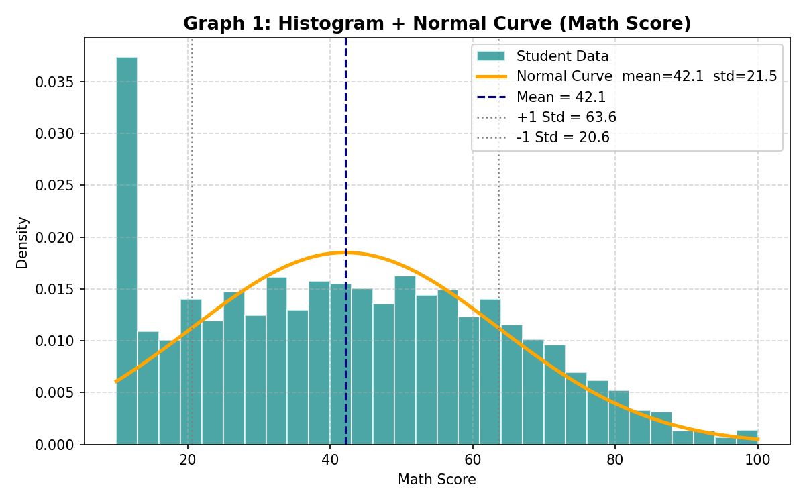
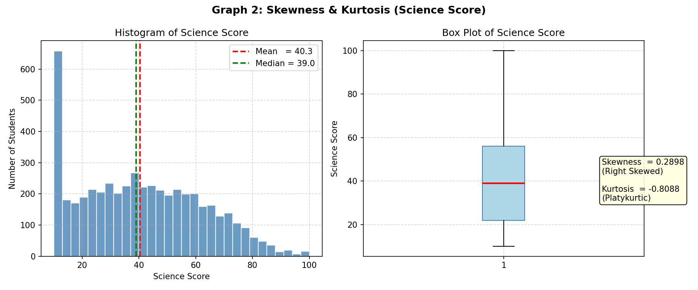
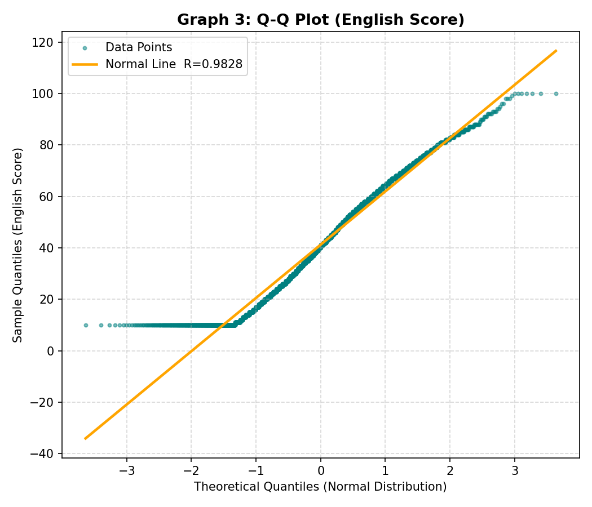

# 📊 Student Scores — Mini Research Report
### Red & White Skill Education | Theory + Practical Exam


---

## 📁 Project Structure

```
📦 Student Scores Project
 ┣ 📄 students_scores.csv          ← Dataset (5000 records)
 ┣ 📓 students_scores.ipynb        ← Jupyter Notebook (all steps)
 ┣ 📄 step1_central_tendency.py    ← Step 1: Mean, Median, Mode
 ┣ 📄 step2_probability.py         ← Step 2: Probability Basics
 ┣ 📄 step3_all_graphs.py          ← Step 3: Distribution & Visualization
 ┣ 📄 step4_linear_algebra.py      ← Step 4: Linear Algebra
 ┗ 📄 README.md                    ← This file
```

---

## 🗃️ Dataset Overview

| Column | Type | Description |
|---|---|---|
| `Student_ID` | String | Unique ID (S0001–S5000) |
| `Age` | Integer | Student age (15–22) |
| `Math_Score` | Integer | Math exam score (10–100) |
| `Science_Score` | Integer | Science exam score (10–100) |
| `English_Score` | Integer | English exam score (10–100) |
| `Hours_Studied` | Float | Daily study hours (0.5–10.0) |
| `Pass_Fail` | Binary | 1 = Pass, 0 = Fail |

> 📌 **5000 student records** — Scores are correlated with `Hours_Studied`

---

## 🛠️ Libraries Used

```python
import pandas as pd
import numpy as np
import matplotlib.pyplot as plt
from scipy import stats
from scipy.stats import skew, kurtosis
```

---

## 📌 PART B — Practical Steps

---

### 🔹 Step 1: Measures of Central Tendency & Dispersion

**Tasks:**
- Calculate **Mean, Median, Mode** of `Math_Score`
- Find **Range, Variance, Standard Deviation** of `Science_Score`

```python
# Mean, Median, Mode
mean_math   = df['Math_Score'].mean()
median_math = df['Math_Score'].median()
mode_math   = df['Math_Score'].mode()[0]

# Range, Variance, Std Dev
range_science    = df['Science_Score'].max() - df['Science_Score'].min()
variance_science = df['Science_Score'].var()
std_dev_science  = df['Science_Score'].std()
```

**📊 Results:**

| Measure | Column | Value |
|---|---|---|
| Mean | Math_Score | **42.11** |
| Median | Math_Score | **42.00** |
| Mode | Math_Score | **10** |
| Range | Science_Score | **90** |
| Variance | Science_Score | **458.03** |
| Std Deviation | Science_Score | **21.40** |

---

### 🔹 Step 2: Probability Basics

**Tasks:**
- Find **P(Pass)** where `Pass_Fail = 1`
- Create a **Contingency Table** — `Pass_Fail` vs `Hours_Studied > 5`
- Calculate **Conditional Probability** — P(Pass | Hours_Studied > 5)

```python
# Probability of Passing
p_pass = df[df["Pass_Fail"] == 1].shape[0] / len(df)

# Contingency Table
df["High_Study"] = df["Hours_Studied"].apply(lambda x: "Hours > 5" if x > 5 else "Hours ≤ 5")
contingency_table = pd.crosstab(df["High_Study"], df["Pass_Fail"], margins=True)

# Conditional Probability
high_study_df = df[df["Hours_Studied"] > 5]
p_pass_given_high = high_study_df[high_study_df["Pass_Fail"] == 1].shape[0] / len(high_study_df)
```

**📊 Results:**

| Metric | Value |
|---|---|
| P(Pass) | **50.34%** |
| P(Fail) | **49.66%** |
| P(Pass \| Hours > 5) | **86.04%** |

**Contingency Table:**

| | Fail (0) | Pass (1) | Total |
|---|---|---|---|
| Hours > 5 | 358 | 2207 | 2565 |
| Hours ≤ 5 | 2125 | 310 | 2435 |
| **Total** | **2483** | **2517** | **5000** |

> 💡 **Key Insight:** Students studying **> 5 hours** have an **86% pass rate** vs the overall **50.3%** — proving `Hours_Studied` and `Pass_Fail` are **dependent events!**

---

### 🔹 Step 3: Distribution & Visualization

**Tasks:**
- Plot **Histogram + Normal Curve** for `Math_Score`
- Calculate **Skewness & Kurtosis** for `Science_Score`
- Perform **Q-Q Plot** for `English_Score`

---

#### 📈 Graph 1 — Histogram + Normal Curve (Math Score)



```python
plt.hist(math_data, bins=30, color="teal", density=True)
plt.plot(x, stats.norm.pdf(x, mu, sigma), color="orange", linewidth=2.5)
plt.show()
```

| Stat | Value |
|---|---|
| Mean (μ) | 42.11 |
| Std Dev (σ) | 21.54 |

---

#### 📈 Graph 2 — Skewness & Kurtosis (Science Score)



```python
from scipy.stats import skew, kurtosis
sk   = skew(df["Science_Score"])    # → 0.2898
kurt = kurtosis(df["Science_Score"]) # → -0.8088
```

| Measure | Value | Meaning |
|---|---|---|
| **Skewness** | 0.2898 | Right Skewed (tail on right side) |
| **Kurtosis** | -0.8088 | Platykurtic (flatter than normal) |

---

#### 📈 Graph 3 — Q-Q Plot (English Score)



```python
(theoretical_q, sample_q), (slope, intercept, r) = stats.probplot(eng, dist="norm")
plt.scatter(theoretical_q, sample_q)
plt.show()
```

| Stat | Value | Interpretation |
|---|---|---|
| R value | 0.9828 | Very close to Normal Distribution ✅ |
| R² | 0.9659 | 96.6% fit to Normal curve |

---

### 🔹 Step 4: Linear Algebra Mini Task

**Tasks:**
- Represent `Math_Score` and `Science_Score` of first 5 students as **vectors**
- Calculate **Dot Product**
- Find **Norm 1 and Norm 2** of Math vector
- Find **Angle** between the two vectors

```python
math_vector    = np.array(df["Math_Score"].head(5))     # [14, 53, 45, 72, 14]
science_vector = np.array(df["Science_Score"].head(5))  # [10, 51, 44, 61, 10]

# Dot Product
dot_product = np.dot(math_vector, science_vector)

# Norms
norm1 = np.linalg.norm(math_vector, ord=1)
norm2 = np.linalg.norm(math_vector, ord=2)

# Angle
cos_theta = dot_product / (norm2 * np.linalg.norm(science_vector))
angle_deg = np.degrees(np.arccos(cos_theta))
```

**📊 Results:**

| Operation | Formula | Result |
|---|---|---|
| Math Vector | — | `[14, 53, 45, 72, 14]` |
| Science Vector | — | `[10, 51, 44, 61, 10]` |
| **Dot Product** | A · B = Σ(Aᵢ × Bᵢ) | **9355** |
| **Norm 1 (L1)** | Σ\|aᵢ\| | **198.0** |
| **Norm 2 (L2)** | √Σaᵢ² | **102.03** |
| **Angle** | cos⁻¹(A·B / ‖A‖‖B‖) | **4.46°** |

> 💡 **Angle = 4.46°** — Very small angle means Math and Science scores are **highly similar/correlated!**

---

## ▶️ How to Run

**1. Install required libraries:**
```bash
pip install pandas numpy matplotlib scipy
```

**2. Run each step separately:**
```bash
python step1_central_tendency.py
python step2_probability.py
python step3_all_graphs.py
python step4_linear_algebra.py
```

**3. Or open the Jupyter Notebook:**
```bash
jupyter notebook students_scores.ipynb
```

> 📁 Make sure `students_scores.csv` is in the **same folder** as all Python files!

---

## 📝 Key Findings Summary

| Step | Finding |
|---|---|
| Step 1 | Math Score Mean = **42.11**, Science Std Dev = **21.40** |
| Step 2 | Students studying > 5 hrs have **86% pass rate** vs 50% overall |
| Step 3 | Science Score is **Right Skewed**, English Score is **nearly Normal** |
| Step 4 | Math & Science vectors have only **4.46° angle** → highly correlated |

---

## 👨‍🎓 Project Info

| | |
|---|---|
| **Institute** | Red & White Skill Education |
| **Exam Type** | Theory + Practical |
| **Duration** | 6 Hours |
| **Dataset** | students_scores.csv (5000 records) |
| **Language** | Python 3.x |

---

*"Quality is our Motto." — Red & White Skill Education* 🎓
